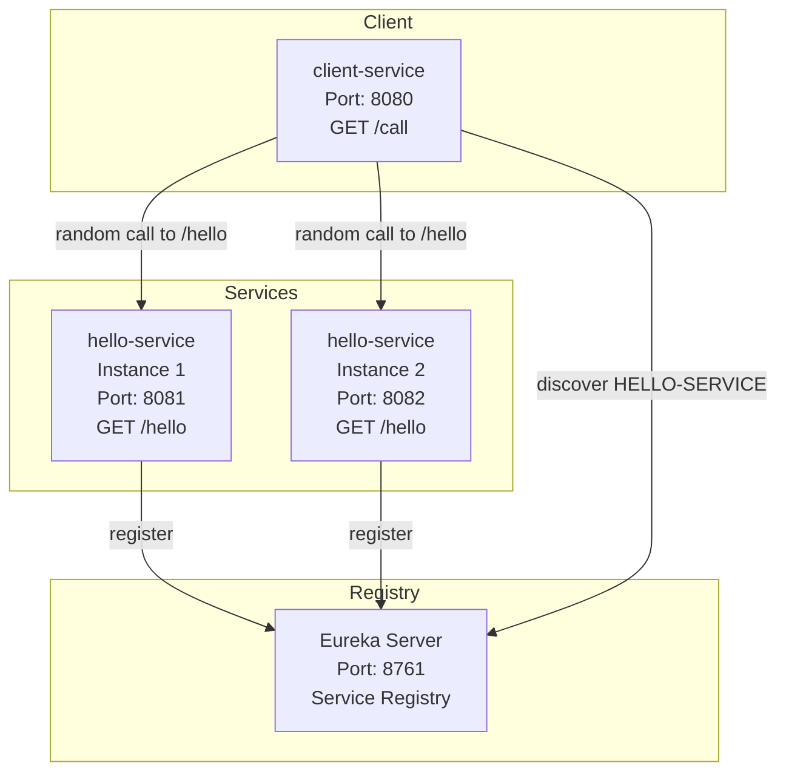
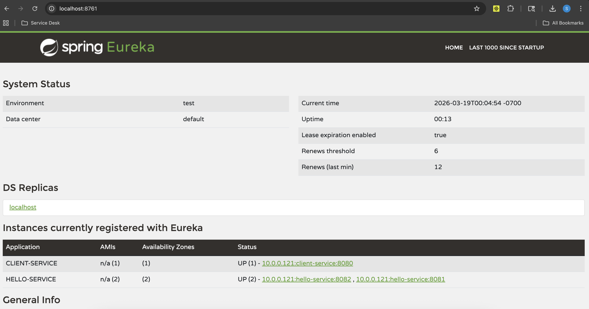
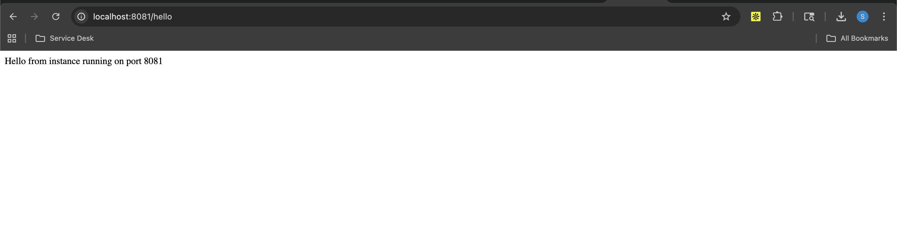
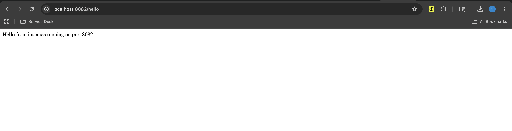
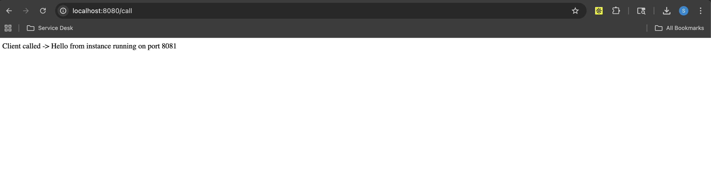

# Week 7 - Naming and Service Discovery Assignment

## Overview

This project demonstrates **service discovery in a microservices architecture** using **Spring Boot** and **Netflix Eureka**.

The system includes:

* **Eureka Server** as the service registry
* **hello-service** running with **2 instances**
* **client-service** that discovers `HELLO-SERVICE` dynamically and calls a random instance

---

## Architecture Diagram



---

## Architecture Explanation

* The **Eureka Server** (port `8761`) acts as the central service registry.
* Two instances of **hello-service** run on ports `8081` and `8082`.
* Both instances **register themselves** with Eureka.
* The **client-service** (port `8080`) queries Eureka to discover available instances.
* The client **randomly selects one instance** and calls its `/hello` endpoint.

---

## Requirements Completed

* Ran **2 service instances**
* Registered both instances with **Eureka registry**
* Client discovered services dynamically
* Client called a **random instance**

---

## Project Structure

```text
week7-service-discovery/
├── eureka-server/
├── hello-service/
├── client-service/
└── README.md
```

---

## Technologies Used

* Java 21
* Spring Boot 3.5.11
* Spring Cloud Netflix Eureka
* Maven
* VS Code

---

## Services and Ports

| Service          | Port | Description              |
| ---------------- | ---- | ------------------------ |
| Eureka Server    | 8761 | Service registry         |
| hello-service #1 | 8081 | Instance 1               |
| hello-service #2 | 8082 | Instance 2               |
| client-service   | 8080 | Service discovery client |

---

## Endpoints

* Eureka Dashboard → [http://localhost:8761](http://localhost:8761)
* Hello Service (Instance 1) → [http://localhost:8081/hello](http://localhost:8081/hello)
* Hello Service (Instance 2) → [http://localhost:8082/hello](http://localhost:8082/hello)
* Client Service → [http://localhost:8080/call](http://localhost:8080/call)

---

## How to Run

### 1. Start Eureka Server

```bash
cd eureka-server
./mvnw clean spring-boot:run
```

---

### 2. Start hello-service (Instance 1)

```bash
cd hello-service
./mvnw clean spring-boot:run -Dspring-boot.run.arguments=--server.port=8081
```

---

### 3. Start hello-service (Instance 2)

```bash
cd hello-service
./mvnw clean spring-boot:run -Dspring-boot.run.arguments=--server.port=8082
```

---

### 4. Start client-service

```bash
cd client-service
./mvnw clean spring-boot:run
```

---

## Expected Output

Open:

```
http://localhost:8080/call
```

You should see alternating responses:

```
Client called -> Hello from instance running on port 8081
```

and

```
Client called -> Hello from instance running on port 8082
```

---

## Proof of Service Discovery

Eureka dashboard shows:

* `HELLO-SERVICE` → 2 instances
* `CLIENT-SERVICE` → 1 instance

## Screenshots

### Eureka Dashboard


---

### Hello Service Instance 1 (Port 8081)


---

### Hello Service Instance 2 (Port 8082)


---

### Client Service Output (Port 8080)


---

## Demo Flow

1. Start Eureka Server
2. Start hello-service (2 instances)
3. Verify both instances in Eureka
4. Start client-service
5. Call `/call` endpoint
6. Observe requests routed to different instances

---

## Optional Extension

This architecture can be extended using a **Service Mesh (Istio / Linkerd)**:

```
App → Sidecar Proxy → Service Mesh → Target Service
```

### Benefits:

* Traffic routing
* Observability
* Security (mTLS)

---

## Summary

This project demonstrates:

* Dynamic service discovery
* Load balancing via client-side logic
* Microservices communication without hardcoded endpoints

